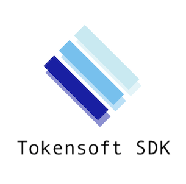

# tokensoft-sdk




#### Roles

Investor:
 - Retail - Create and manage your account
 - Institutional - Create an account for your entity or fund
 - Broker Dealer or RIA - Create accounts on behalf of your clients

Administrator:
 - Broker Dealer ATS - Create accounts at the Tokensoft Transfer Agent and associate wallets with accounts.
 - Exchange - Create accounts at Tokensoft or the Tokensoft Transfer agent and associate wallets with accounts.


#### Assets

Every administrator will need unique credential per asset. Each set of credentials will enable an administrator to whitelist wallets to be authorized to hold the tokens.


#### Authentication

Export the authentication token on the command line:

```
$ export KEY_ID='TSXXXXXXXXXXXXXXXXXXXXXXXXXXXXXXXXXXX
$ export SECRET_KEY='TSXXXXXXXXXXXXXXXXXXXXXXXXXXXXXXXXXXX
```

```typescript
import TokensoftSDK from 'Tokensoft'
 
const authenticationToken = process.env.AUTH_TOKEN
// Insert authentication call
```

## Role: Administrator

